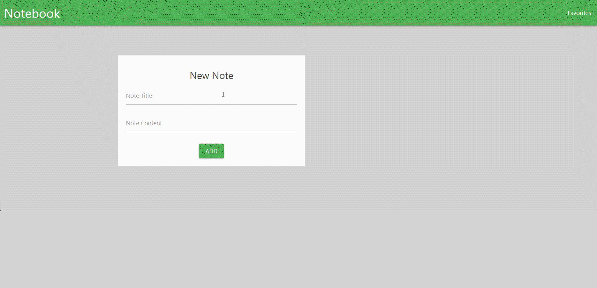
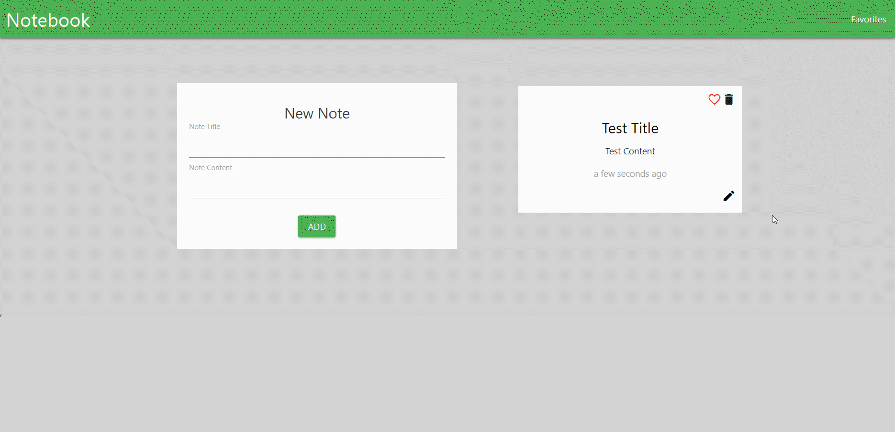
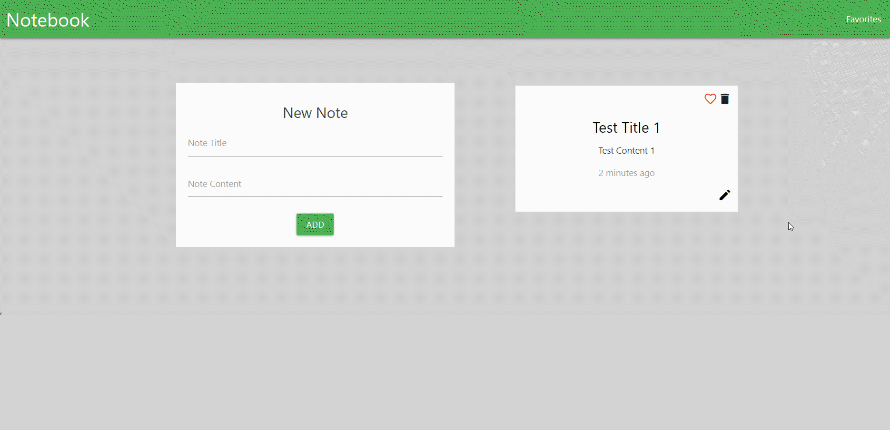
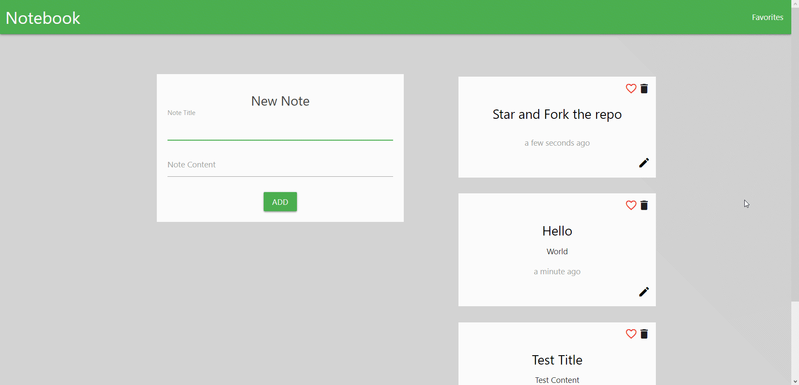
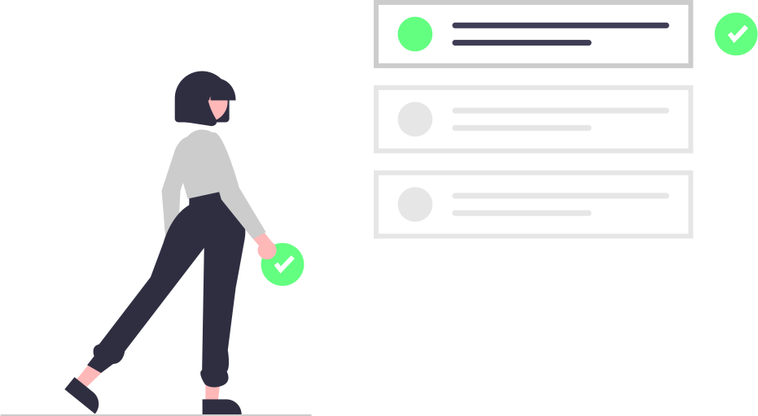

<div align="center">

<!-- 


[](https://github.com/blackphoenix42/Note_Taking_App/blob/master/LICENSE) -->


### NOTES TAKING APP

<h3>Join official <a href="https://discord.gg/mRUZEhD">Discord Server</a> for discussion.</h3>


</div>

# 📃About

An app where you can write, edit and delete your notes. You can also mark important notes as favorites.

### Add Note➕:



### Edit Note✒:



### Delete Note➖:



### Favorite Notes🧡:



# 🌱 Quick Start

- Star🌟 and Fork this repository

- Clone this repository remotely.

```sh
git clone https://github.com/blackphoenix42/Note_Taking_App.git
```

- Install the dependencies

```sh
npm install
```

- Start the app

```sh
npm start
```

# 🐱‍👤Build

To build the app use:

```sh
npm run build
```

<div align="center">
	
</div>

## 🚀 How to Contribute to Project?

- Take a look at the Existing [Issues](https://github.com/blackphoenix42/Note_Taking_App/issues) or create your own Issues!
- Check out [CONTRIBUTING.md](./CONTRIBUTING.md)

<div align="center">
	
</div>

## 👾 Project Admin

<table>
	<tr>
		<td align="center">
			<a href="https://github.com/blackphoenix42">
				
				<br /> <sub><b>blackphoenix42</b></sub>
			</a>
			<br /> <a href="https://github.com/blackphoenix42"> 
		👑 Admin
	    </a>
		</td>
	</tr>
</table>

<!-- ## 🌟 Contributors

<table>
	<tr>
		<td>
			contrib.rocks
			</a>
		</td>
	</tr>
</table> -->
<div align="center">
<br /> 
<sub><b>Thank You</b></sub>
</div>
